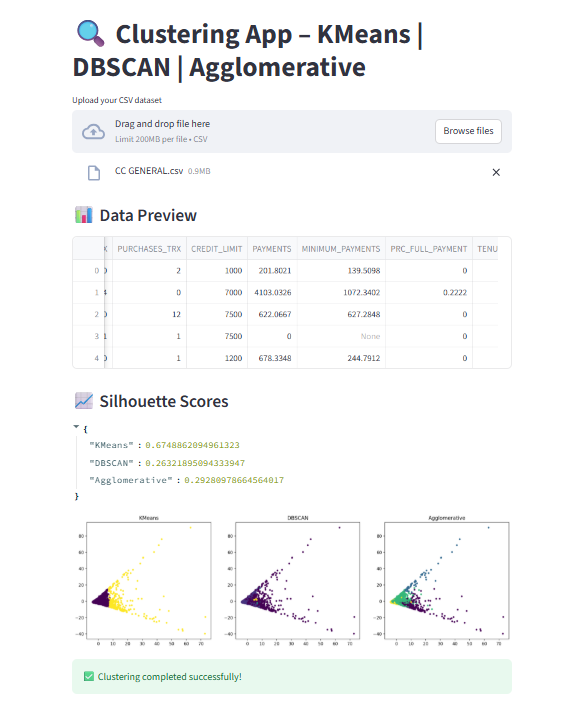
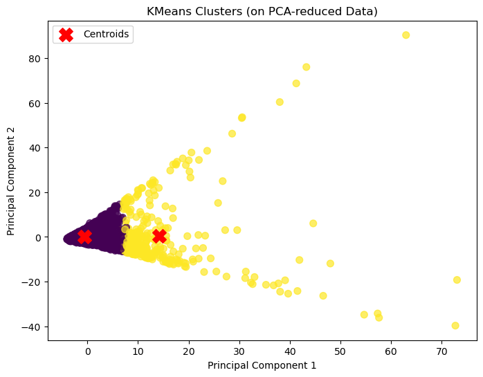
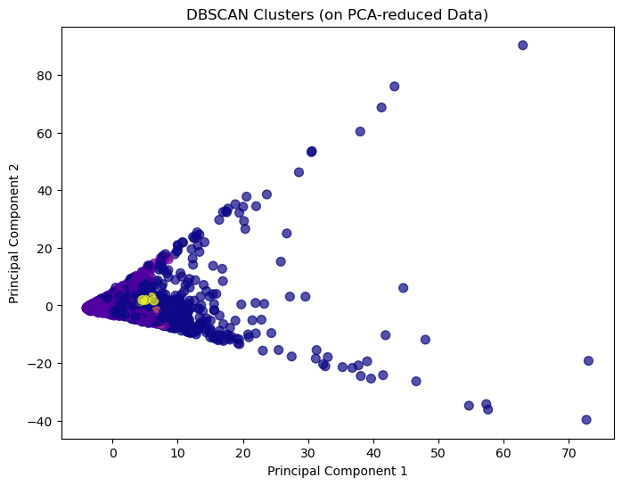
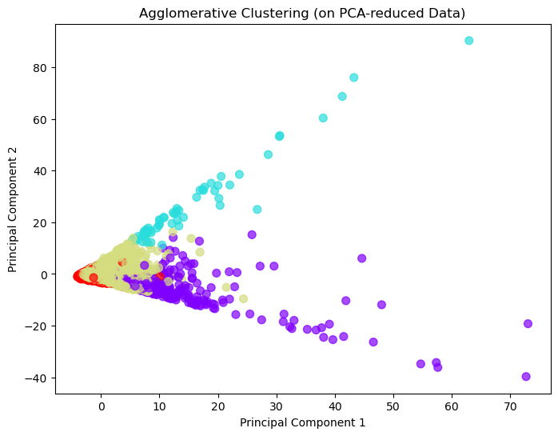

# 🔍 Clustering App – KMeans | DBSCAN | Agglomerative  

A **Streamlit web application** that allows users to upload their dataset and explore **unsupervised clustering methods** with clear **visualizations** and **silhouette scores**.  

This app applies preprocessing (Yeo-Johnson transformation, scaling, PCA) and compares the performance of three clustering models:  

- 🟢 **KMeans**  
- 🔵 **DBSCAN**  
- 🟣 **Agglomerative Clustering**  

---

## 🌐 Live Demo  
👉 [Try the App Here](https://unsupervised-learning-clustering-part-1-mzgffkvzxqofsenktefxgw.streamlit.app/)  

---

## 📸 App Screenshots  

### 📊 Upload Dataset & View Scores  
  

### 🟢 KMeans Clustering  
  

### 🔵 DBSCAN Clustering  
  

### 🟣 Agglomerative Clustering  
  

---

## ⚙️ Features  
✔️ Upload any **CSV dataset**  
✔️ Automatic **data preprocessing** (drop IDs, handle skewness, scaling, PCA)  
✔️ Run **3 clustering algorithms**  
✔️ View **Silhouette scores** for each model  
✔️ Compare **side-by-side cluster visualizations**  

---

## 🛠️ Tech Stack  
- Python 🐍  
- Streamlit 🎈  
- scikit-learn 🤖  
- Pandas & NumPy 📊  
- Matplotlib & Seaborn 🎨  

---

## 🚀 Run Locally  

1. Clone this repo  
   ```bash
   git clone https://github.com/your-username/clustering-app.git
   cd clustering-app
2. Create a virtual environment (optional but recommended)

python -m venv venv
source venv/bin/activate   # On Windows: venv\Scripts\activate


3. Install dependencies

pip install -r requirements.txt


4. Run the app

streamlit run app.py


5. Open in your browser 👉 http://localhost:8501

🤝 Contributing

Pull requests are welcome! Feel free to fork this repo and submit improvements.

